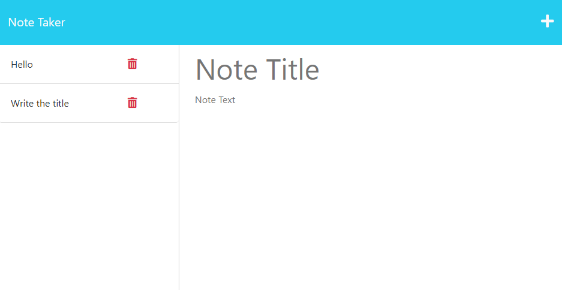

# Clearwater Note Taker
 

## Description

A simple notetaker app using express.js.  Simply saves, displays, and deletes notes.

## Installation

Visit Clearwater Note Taker deplayed on heroku at [https://limitless-escarpment-66953-55caf2372071.herokuapp.com/](https://limitless-escarpment-66953-55caf2372071.herokuapp.com/).

## Usage

1. Visit the heroku deployment
2. Click "Get Started"
3. Write the note title and content
4. Press Save
5. In the list on the left, click on the note to display it
6. Press the bin to delete

## Licence

## Credits

I found a very useful bit of code for logging requests to the console in order to see what's happening as I created this thing.
It was by [StackOverflow user James](https://stackoverflow.com/users/1013380/james) and [can be found here](https://stackoverflow.com/a/68687930/1440135).

## Badges

___
This README was generated by [writeme-readme](https:github.com/poisoned-eden/writeme-readme)